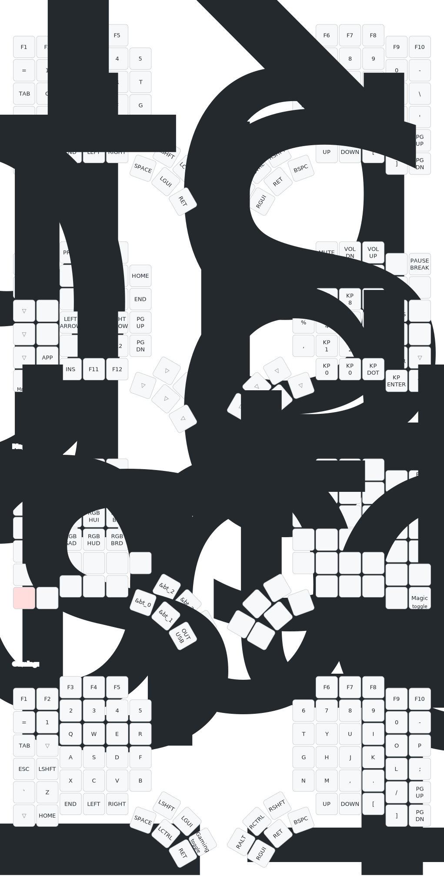

# Usage

## Build firmware

```sh
# This will output the firmware file to `/result/glove80.uf2`
nix build 
```

## Flash firmware

```sh
# Connect half (in bootloader mode) then run this. repeat this for both halves
nix run
```

## Layout



# Credits

Layout adapted from [MoErgo's template](https://github.com/moergo-sc/glove80-zmk-config)
Nix flake based on [Matt Sturgeon's config](https://github.com/MattSturgeon/glove80-config)
