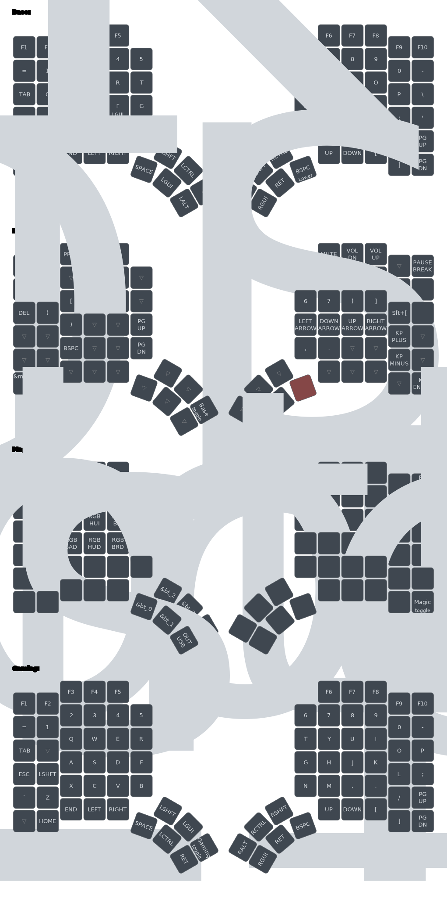

# Usage

## Build firmware

Executing `nix build` will output the firmware file to `/result/glove80.uf2`

## Flash firmware

First execute `nix run`, then connect both halves and put them into bootloader mode.

## Other

To format `.dts` and `.dtsi` files in the repository run `nix run .#format .`

Running `nix build .#visual` generates a visualization of the keymap and writes it to `/result/layout.svg`

## Layout

# Credits

Layout adapted from [MoErgo's template](https://github.com/moergo-sc/glove80-zmk-config)
Nix flake based on [Matt Sturgeon's config](https://github.com/MattSturgeon/glove80-config)
